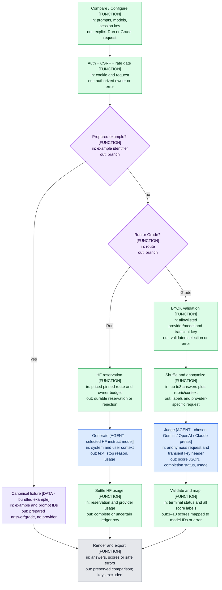

# Model Arena request flow

The browser stores comparison content by account. It keeps the grader key only in memory. The server authenticates every provider request and uses a fixed upstream destination. HF generation reserves hosted funds; user-key grading does not. Both paths are bounded and make one upstream attempt.

The green boxes are deterministic functions, blue boxes are actual provider model calls, purple boxes are data, diamonds choose paths, and gray is the user-visible result. In local fixture QA the blue steps are intercepted outside application code; no real model is called.

Gates: server requires auth and session CSRF; grade rate90/hour; provider capacity3/owner and6/process; output cap2048tokens; provider response1MiB; timeout45seconds; anonymous answers1–3; prompt/reference8k, system20k, corpus30k characters. Model Arena does not retry or fall back automatically.

File index: UI and persistence `app/page.js`; session ownership `app/client/session.mjs`; public presets `app/client/grader.mjs`; auth `lib/auth.js`; shared rubric and scoring `lib/providers.js`; provider-specific wires `lib/grader-provider.js`; bounded transport `lib/provider-http.js`; hosted budget `lib/usage.js`; PostgreSQL `lib/db.js`.
